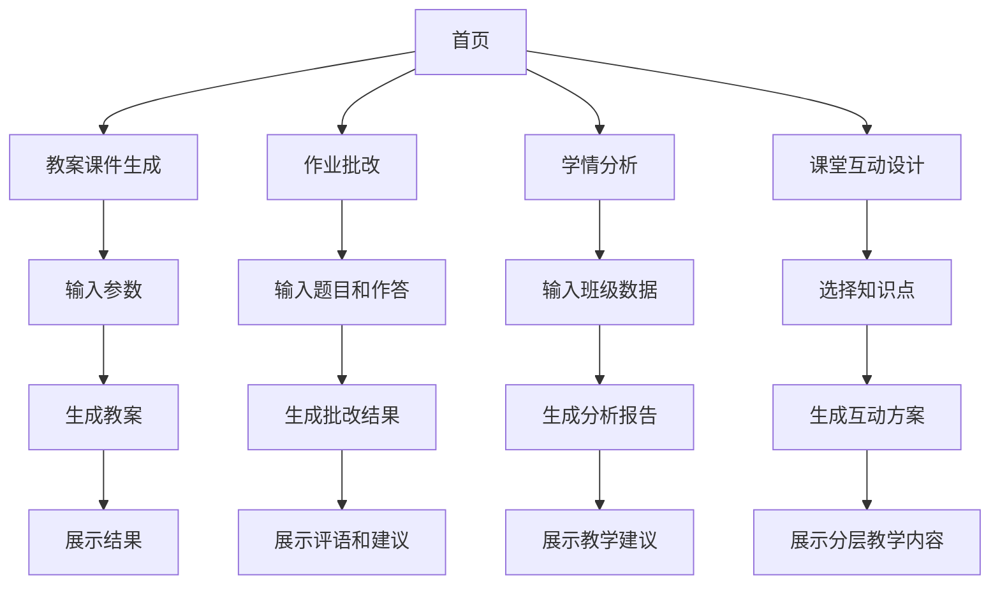

## 1. Product Overview
【Hello AI 科技致善】SOLO 为乡村教师打造零门槛全科教学助手，解决乡村教师备课教研资源匮乏、多学科授课负担重、作业批改与学情分析效率低的核心痛点。
- 面向中国县域、乡镇及村级中小学一线教师，提供学情适配的教案课件生成、课堂重难点拆解、全类型作业批改、学情分析四大核心能力。
- 目标是将教师单课时备课时长从2小时压缩至2分钟，作业批改效率提升90%以上，实现零门槛上手。

## 2. Core Features

### 2.1 User Roles
| Role | Registration Method | Core Permissions |
|------|---------------------|------------------|
| 乡村教师 | 无需注册 | 使用所有核心功能，包括教案生成、作业批改、学情分析等 |

### 2.2 Feature Module
1. **首页**：功能模块导航、使用指南、快速入口
2. **教案课件生成**：年级学科选择、教材版本选择、学情适配设置、生成结果展示
3. **作业批改**：题目输入、学生作答输入、批改结果展示、个性化评语生成
4. **学情分析**：班级数据输入、分析报告生成、教学建议展示
5. **课堂互动设计**：知识点选择、分层教学方案生成、互动游戏设计

### 2.3 Page Details
| Page Name | Module Name | Feature description |
|-----------|-------------|---------------------|
| 首页 | 导航栏 | 展示四大核心功能模块入口，提供快速切换 |
| 首页 | 使用指南 | 提供简洁的使用步骤说明，帮助教师快速上手 |
| 教案课件生成 | 参数设置 | 允许教师输入年级、学科、课时、教材版本，选择学情适配标签 |
| 教案课件生成 | 结果展示 | 展示生成的完整教案、PPT大纲、课堂逐字稿，支持复制和下载 |
| 作业批改 | 输入模块 | 提供题目和学生作答的输入区域，支持多行文本输入 |
| 作业批改 | 批改结果 | 展示批改结果、错误点分析、个性化评语、教师辅导建议 |
| 学情分析 | 数据输入 | 允许教师输入班级作业/考试错题数据，支持批量导入 |
| 学情分析 | 分析报告 | 生成学情分析报告，定位高频错误知识点，给出补弱教学方案 |
| 课堂互动设计 | 知识点选择 | 允许教师选择单课时知识点，生成分层教学方案 |
| 课堂互动设计 | 互动方案 | 生成无需电子设备的课堂互动小游戏、提问脚本、分层课堂练习 |

## 3. Core Process
用户进入首页后，选择所需的功能模块，根据引导输入相关信息，系统生成对应内容并展示结果。教师可以根据需要复制、下载或进一步调整生成的内容。

## 4. User Interface Design
### 4.1 Design Style
- 主色调：绿色 (#4CAF50) 和蓝色 (#2196F3)，象征希望和知识
- 辅助色：暖黄色 (#FFC107)，增加亲和力
- 按钮样式：圆角按钮，有轻微的3D效果，悬停时有渐变效果
- 字体：使用无衬线字体，主标题18-24px，副标题16px，正文14px
- 布局风格：卡片式布局，清晰的视觉层次，充分利用空白空间
- 图标风格：简约线条图标，搭配乡村元素，如书本、黑板、铅笔等

### 4.2 Page Design Overview
| Page Name | Module Name | UI Elements |
|-----------|-------------|-------------|
| 首页 | 导航栏 | 顶部固定导航，四个核心功能模块图标+文字，使用主色调，悬停时高亮 |
| 首页 | 使用指南 | 卡片式布局，步骤清晰，配有图标说明，背景使用轻微的乡村风格图案 |
| 教案课件生成 | 参数设置 | 表单布局，下拉选择器和单选按钮，标签清晰，输入框有占位符提示 |
| 教案课件生成 | 结果展示 | 标签页切换不同内容（教案、PPT大纲、逐字稿），内容区域有滚动条，支持复制按钮 |
| 作业批改 | 输入模块 | 分区域输入题目和作答，有字数提示，支持换行和基本格式化 |
| 作业批改 | 批改结果 | 卡片式展示，批改结果醒目，错误点用红色标注，评语和建议用绿色标注 |
| 学情分析 | 数据输入 | 文本区域输入，支持粘贴批量数据，有示例提示 |
| 学情分析 | 分析报告 | 图表展示高频错误知识点，文字说明教学建议，支持下载报告 |
| 课堂互动设计 | 知识点选择 | 搜索框和下拉选择器，支持模糊匹配，展示相关知识点 |
| 课堂互动设计 | 互动方案 | 分层次展示基础和进阶内容，互动游戏配有简单示意图，课堂练习有答案提示 |

### 4.3 Responsiveness
- 设计采用桌面端优先，同时支持移动端自适应
- 在移动设备上，导航栏变为底部标签栏，内容垂直排列
- 支持触摸操作，按钮和输入区域有足够的点击区域
- 在低网络条件下，优先加载核心功能，减少图片和动画效果

### 4.4 3D Scene Guidance
- 不适用，本项目以功能为主，不需要3D场景