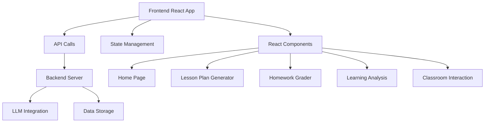
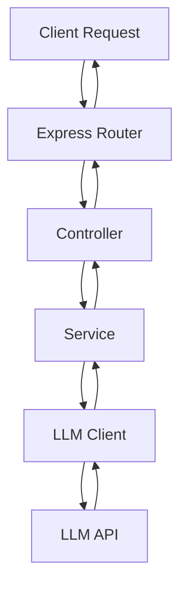

## 1. Architecture Design


## 2. Technology Description
- Frontend: React@18 + TypeScript + Tailwind CSS@3 + Vite
- Initialization Tool: vite-init
- Backend: Express@4 (for LLM API calls and processing)
- Database: None (temporary storage in memory)
- External Services: LLM API (for content generation)

## 3. Route Definitions
| Route | Purpose |
|-------|---------|
| / | Home page with navigation to all features |
| /lesson-plan | Lesson plan and课件 generation |
| /homework-grade | Homework grading and feedback |
| /learning-analysis | Learning situation analysis |
| /classroom-interaction | Classroom interaction design |

## 4. API Definitions

### 4.1 Lesson Plan Generation API
- **Endpoint**: POST /api/lesson-plan
- **Request Body**:
  ```typescript
  interface LessonPlanRequest {
    grade: string;
    subject: string;
    lesson: string;
    textbookVersion: string;
    studentLevel: 'weak' | 'medium' | 'good';
    localTags: string[];
  }
  ```
- **Response Body**:
  ```typescript
  interface LessonPlanResponse {
    teachingObjectives: {
      knowledge: string[];
      process: string[];
      emotion: string[];
    };
    teachingFocus: {
      keyPoints: string[];
      difficulties: string[];
      solutions: string[];
    };
    teachingProcess: {
      section: string;
      duration: number;
      teacherTalk: string;
      studentActivity: string;
      blackboardDesign: string;
    }[];
    classScript: string;
    pptOutline: string[];
  }
  ```

### 4.2 Homework Grading API
- **Endpoint**: POST /api/homework-grade
- **Request Body**:
  ```typescript
  interface HomeworkGradeRequest {
    question: string;
    studentAnswer: string;
    grade: string;
    fullScore: number;
  }
  ```
- **Response Body**:
  ```typescript
  interface HomeworkGradeResponse {
    result: 'correct' | 'incorrect' | 'partial';
    score: number;
    errorAnalysis: string;
    correction: string;
    comment: string;
    teacherAdvice: string;
  }
  ```

### 4.3 Learning Analysis API
- **Endpoint**: POST /api/learning-analysis
- **Request Body**:
  ```typescript
  interface LearningAnalysisRequest {
    classData: string;
  }
  ```
- **Response Body**:
  ```typescript
  interface LearningAnalysisResponse {
    report: string;
    highFrequencyErrors: string[];
    teachingSuggestions: string[];
    parentCommunication: string;
  }
  ```

### 4.4 Classroom Interaction API
- **Endpoint**: POST /api/classroom-interaction
- **Request Body**:
  ```typescript
  interface ClassroomInteractionRequest {
    knowledgePoint: string;
    grade: string;
    subject: string;
  }
  ```
- **Response Body**:
  ```typescript
  interface ClassroomInteractionResponse {
    layeredTeaching: {
      basic: string[];
      advanced: string[];
    };
    interactiveGames: string[];
    questionScripts: string[];
    layeredExercises: string[];
  }
  ```

## 5. Server Architecture Diagram


## 6. Data Model
### 6.1 Data Model Definition
- No persistent data storage required. All data is processed in memory and returned to the client.

### 6.2 Data Definition Language
- No database tables needed. The application uses temporary in-memory storage for processing requests.